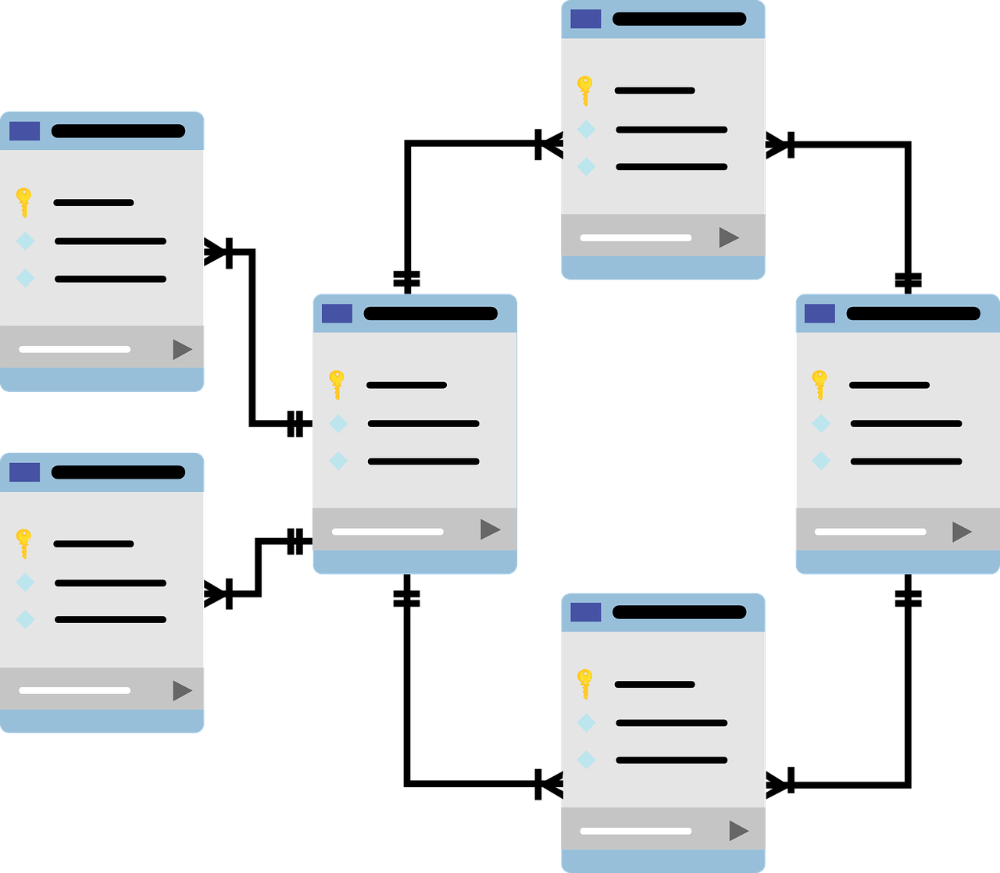

# Base de Datos 

> En este repositorio se encuentran temas en relación a base de datos, diseño, lenguaje sql, manejo de Sistemas Gestores de Base de datos como Mysql y Microsoft SQL Server

Los temas que se encuentran en el repositorio son:

1. Fundamentos de Base de datos.
2. Modelado de Base de Datos
3. Construcción de Base de Datos
4. Lenguaje Estructurado de Consulta

